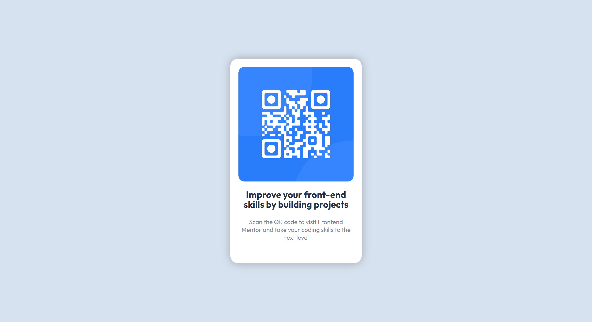

# Frontend Mentor - QR code component solution

This is a solution to the [QR code component challenge on Frontend Mentor](https://www.frontendmentor.io/challenges/qr-code-component-iux_sIO_H). Frontend Mentor challenges help you improve your coding skills by building realistic projects.

## Table of contents

- [Screenshot](#screenshot)
- [Links](#links)
- [My process](#my-process)
  - [Built with](#built-with)
  - [What I learned](#what-i-learned)
  - [Useful resources](#useful-resources)
- [Author](#author)

### Screenshot



### Links

- Live Site URL: [Add live site URL here](https://your-live-site-url.com)

## My process

- I created a div for the parent card
- I decided not to use the qr image provided, so I created a child div for the qr code wrapper, and used the :before and :after pseudo classes to create the two circular patterns
- I created a qr code that leads to front-end masters and

### Built with

- Semantic HTML5 markup
- CSS custom properties
- Flexbox

### What I learned

I have seen the aspect-ration CSS property but haven't tried it. I used it in this project

```css
.container__img {
  aspect-ratio: 1;
}
```

### Useful resources

- [QR Code Generator](https://www.the-qrcode-generator.com/) - I used it to generate the QR Code.

## Author

- Frontend Mentor - [@aimhigh99](https://www.frontendmentor.io/profile/aimhigh99)
- Twitter - [@ericaimhigh](https://www.twitter.com/ericaimhigh)
